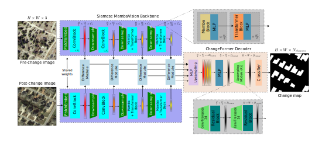
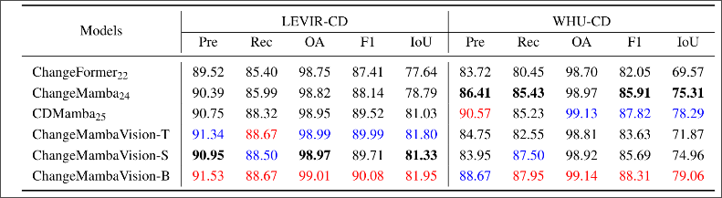

<h1 align="center" style="font-size:48px; font-weight:600;">
  ChangeMambaVision: 
  Adapting MambaVision for Building Change Detection
</h1>

## Metrics of -T, -S, -B checkpoints

## Changes from original -> custom MambaVision

1. For the initial patch embedding layer (PatchEmbed),
BatchNorm2d layers are changed to LayerNorm2d.

2. LayerNorm2d is applied to the features after every level
and before downsampling to the next level.

3. MambaVision.forward() is modified to return intermediate features at each level after the normalization layer
introduced at modification (2).

4. kwargs[‘resolution’] is changed from 224 to 256 to
match the size of the patched dataset images

## Usage

For now supported usage is through code/notebook as linked in the example usage notebook.

Example usage notebook: [Google Colab](https://colab.research.google.com/drive/1a4PRenQ04i1NBtV05Zzv-i5woGyuMGdc?usp=sharing)

## Available checkpoints

ChangeMambaVision should work with any checkpoint of MambaVision. However we only tested the -T, -S, and -B checkpoints.

Please raise a github issue if there are 
some incompatibility of a checkpoint with ChangeFormer due to 
e.g. mismatched encoder-decoder channels or import error.

## Datasets

The LEVIR-CD dataset can be downloaded from [the official website](https://justchenhao.github.io/LEVIR/).

The WHU-CD dataset can be downloaded from [the official website](https://gpcv.whu.edu.cn/data/building_dataset.html) at Section 4 - Building change detection dataset.

## Open data

For availability of research data, 

logs and training checkpoints can be found here: 
[LEVIR-CD](https://drive.google.com/drive/folders/1n5511TPaLOWhYHGyuyc2cpG6hLmYjPmL?usp=sharing) and 
[WHU-CD](https://drive.google.com/drive/folders/1KZ1SUP1tSouDOT9JFabAVi84lHoeVdbd?usp=sharing)

## Licenses

Copyright © 2025, NVIDIA Corporation. All rights reserved.

This work is made available under the NVIDIA Source Code License-NC. Click [here](LICENSE) to view a copy of this license.

The pre-trained models are shared under [CC-BY-NC-SA-4.0](https://creativecommons.org/licenses/by-nc-sa/4.0/). If you remix, transform, or build upon the material, you must distribute your contributions under the same license as the original.

For license information regarding the timm repository, please refer to its [repository](https://github.com/rwightman/pytorch-image-models).

For license information regarding the ImageNet dataset, please see the [ImageNet official website](https://www.image-net.org/). 

